# Investment Macro Analyzer

> A free, open-source desktop application for macroeconomic analysis and market risk assessment. Built with Rust + Tauri v2 + React 19.


---

## Overview

Investment Macro Analyzer is a desktop application that aggregates **110+ macroeconomic indicators** from multiple data sources and provides a unified **Market Risk Score (0-100)** to help you understand current market conditions at a glance.

> ⚠️ **Disclaimer:** This tool is for **informational and educational purposes only**. It does NOT constitute investment advice. See [DISCLAIMER.md](./DISCLAIMER.md) for full details.

## 📸 Screenshots

### Overview — Market Risk Score & Key Indicators
<p align="center">
  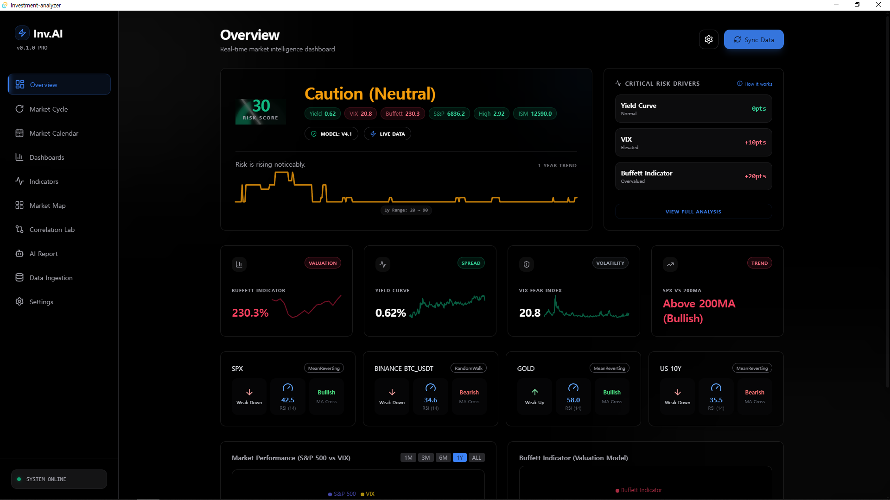
  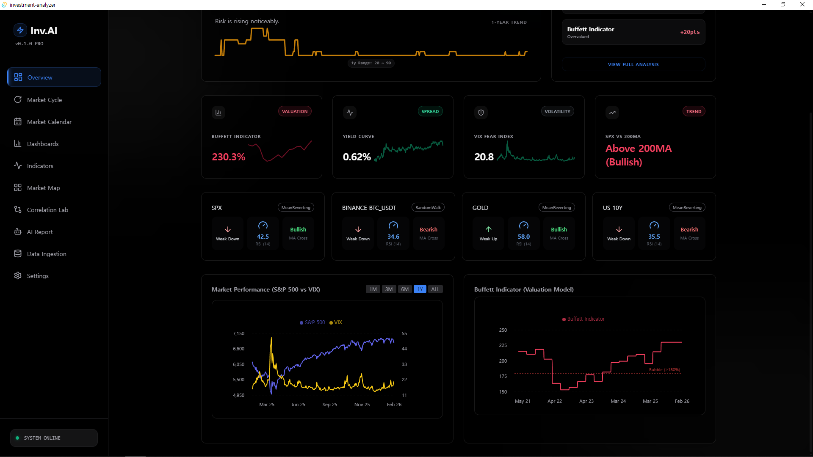
</p>

### Dashboards & Indicators
<p align="center">
  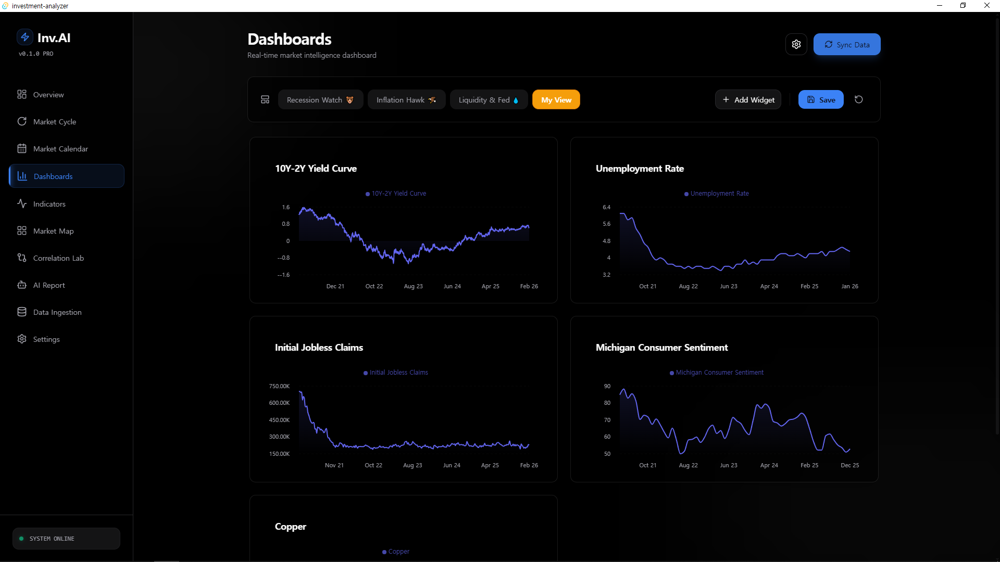
  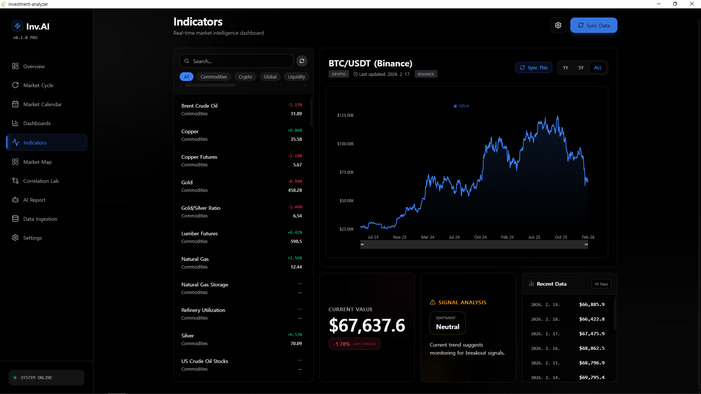
</p>

### Market Cycle & Market Map
<p align="center">
  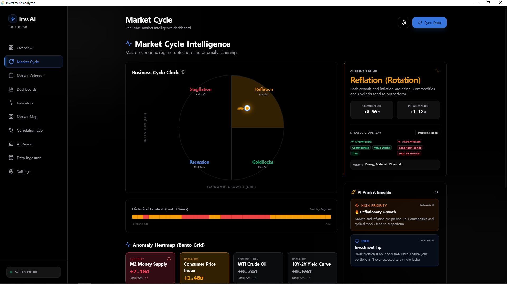
  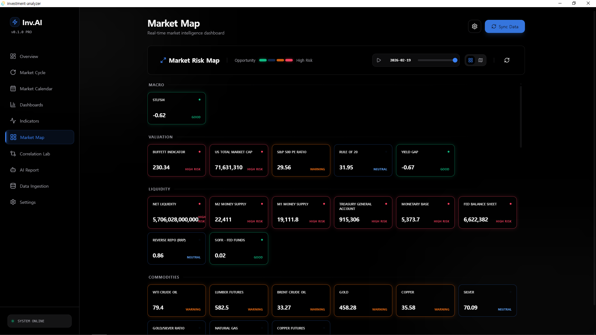
</p>

### Correlation Lab
<p align="center">
  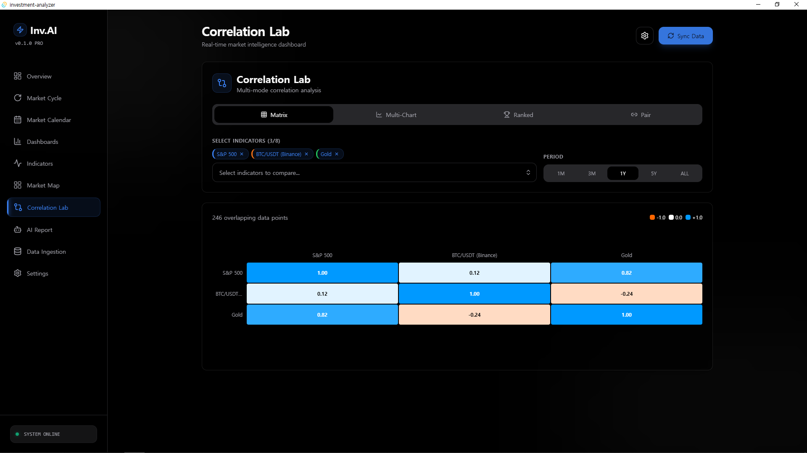
  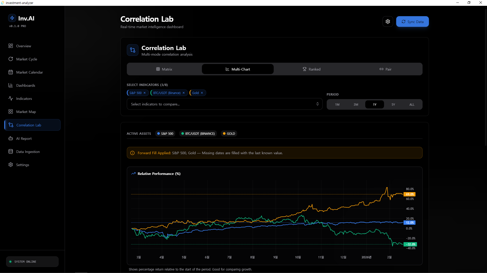
</p>

### AI Report & Market Calendar
<p align="center">
  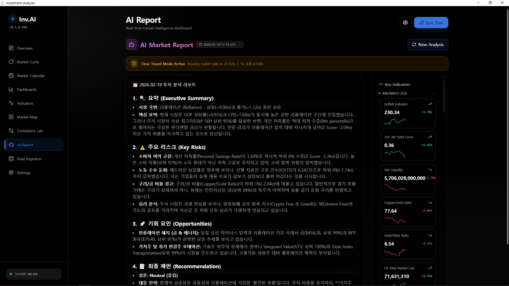
  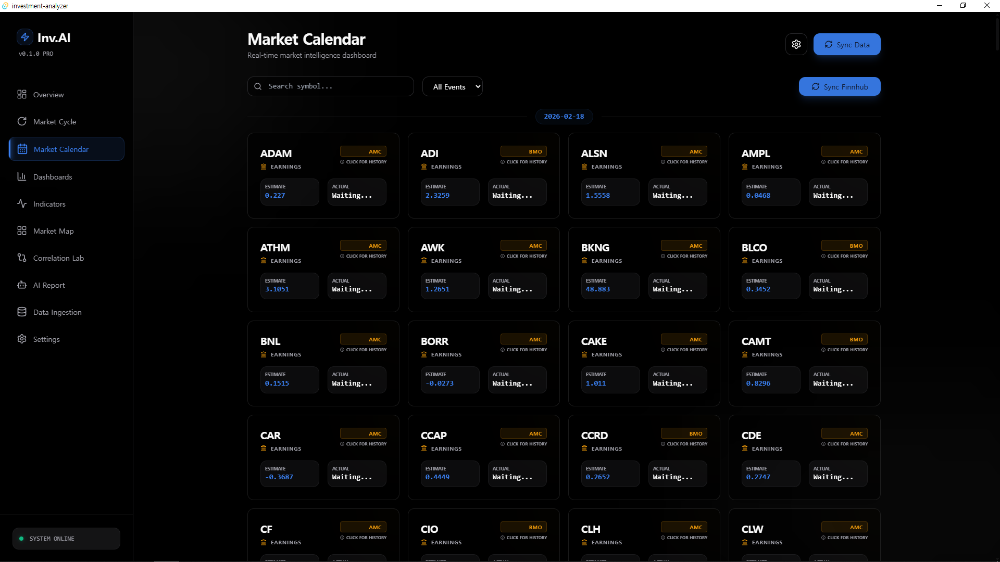
</p>

### Data Ingestion & Settings
<p align="center">
  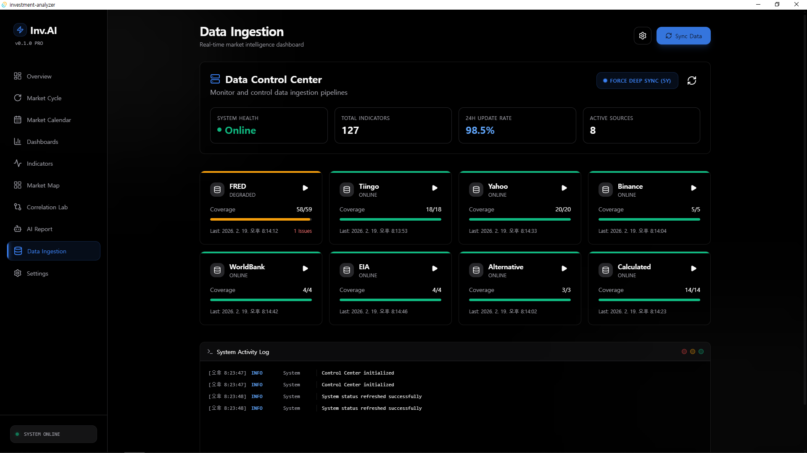
  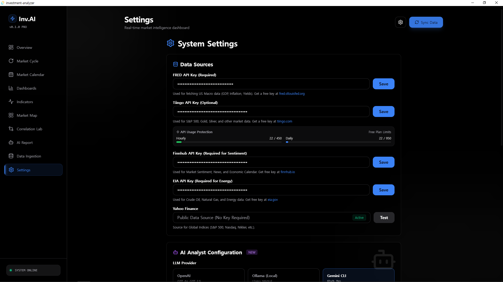
</p>

---

## ✨ Features

### 📊 Market Overview & Risk Score
- **Market Risk Score (0-100)** — Composite score from yield curve, VIX, liquidity, and valuation signals
- **Market Regime Detection** — Automatically classifies the current environment (Goldilocks, Reflation, Stagflation, Recession)
- **Actionable Signals** — Risk-Off/On alerts, yield curve warnings, VIX spikes, and more

### 📈 110+ Economic Indicators
- **Categories:** Growth, Inflation, Labor, Housing, Monetary, Sentiment, Volatility, Crypto, Commodities, and more
- **Interactive Charts** — Powered by Lightweight Charts & Recharts
- **Z-Score Analysis** — Statistical anomaly detection for each indicator

### 🧪 Analysis Tools
- **Correlation Lab** — Cross-correlation analysis between any two indicators
- **Market Cycle View** — Yield curve, leading indicators, and recession probability
- **Market Map** — Treemap visualization of indicator categories
- **Data Lab** — Raw data exploration and export

### 🤖 AI-Powered Analysis
- **AI Market Reports** — Generate comprehensive market analysis using Gemini/OpenAI
- **Prompt Engineering** — Dynamically enriched prompts with current indicator data

### 📅 Market Calendar
- **Earnings Calendar** — Upcoming earnings releases
- **IPO Calendar** — New listings tracker

### 🌐 Internationalization
- English and Korean language support (i18n)

---

## 🛠️ Tech Stack

| Layer | Technology |
|-------|-----------|
| **Backend** | Rust, Tauri v2 |
| **Frontend** | React 19, TypeScript, Vite |
| **Database** | SQLite (via sqlx) |
| **Styling** | Tailwind CSS, Framer Motion |
| **Charts** | Lightweight Charts, Recharts, Nivo |
| **Data Sources** | FRED, Tiingo, Finnhub, Binance, EIA, World Bank, Alternative.me |

---

## 🛠️ Bonus Tool: DB Admin Dashboard

A **Streamlit-based web dashboard** (`dashboard.py`) is included for inspecting and visualizing the local SQLite database directly in your browser.

```bash
# Install dependencies
pip install streamlit pandas plotly

# Run the dashboard
streamlit run dashboard.py
```

This tool auto-detects the database location (AppData or local dev path) and provides interactive charts and table views for all stored indicator data.

---

## 🚀 Quick Start

### Prerequisites

- [Rust](https://rustup.rs/) (1.75+)
- [Node.js](https://nodejs.org/) (18+)
- [Tauri v2 Prerequisites](https://v2.tauri.app/start/prerequisites/)

### Installation

```bash
# Clone the repository
git clone https://github.com/YOUR_USERNAME/investment-macro-analyzer.git
cd investment-macro-analyzer

# Install frontend dependencies
npm install

# Run in development mode
npm run tauri dev
```

### Build for Production

```bash
npm run tauri build
```

---

## 🔑 API Keys Setup

This application uses a **"Bring Your Own Key"** model. You provide your own API keys, and the app fetches data directly to your local machine. No data passes through any intermediary server.

| API | Required | Free Tier | Sign Up |
|-----|:--------:|-----------|---------|
| **FRED** | ✅ Yes | Unlimited | [fred.stlouisfed.org/docs/api](https://fred.stlouisfed.org/docs/api/api_key.html) |
| **Tiingo** | Optional | 1,000 req/day | [api.tiingo.com](https://api.tiingo.com/) |
| **Finnhub** | Optional | 60 req/min | [finnhub.io](https://finnhub.io/) |
| **EIA** | Optional | Unlimited | [eia.gov/opendata](https://www.eia.gov/opendata/register.php) |

After launching the app, go to **Settings** to enter your API keys.

> **FRED API Key is required** for core macroeconomic indicators (GDP, CPI, interest rates, etc.). Other keys are optional but unlock additional data sources.

---

## 📂 Project Structure

```
investment-macro-analyzer/
├── src/                    # React frontend
│   ├── components/
│   │   ├── views/          # Main application views (11 views)
│   │   ├── modals/         # Settings, alerts
│   │   ├── layout/         # App layout, sidebar
│   │   └── ui/             # Reusable UI components
│   ├── i18n/               # Internationalization
│   └── App.tsx             # Main application entry
├── src-tauri/              # Rust backend
│   └── src/
│       ├── analysis/       # Market status, regime, signals, statistics
│       ├── fetcher/        # Data source integrations (FRED, Tiingo, etc.)
│       ├── indicators/     # Indicator definitions & calculations
│       ├── commands/       # Tauri command handlers
│       ├── core/           # Scheduler, alerts
│       ├── llm/            # AI report generation
│       └── db.rs           # SQLite database layer
├── docs/                   # Documentation & legal analysis
└── public/                 # Static assets
```

---

## 📊 Data Sources & Attribution

This application uses data from the following sources:

| Source | Data | License/Terms |
|--------|------|---------------|
| [FRED](https://fred.stlouisfed.org/) | Macroeconomic indicators | [FRED Terms](https://fred.stlouisfed.org/docs/api/terms_of_use.html) |
| [Tiingo](https://www.tiingo.com/) | Stock, crypto, FX prices | [Tiingo Terms](https://www.tiingo.com/about/terms) |
| [Finnhub](https://finnhub.io/) | Earnings & IPO calendar | [Finnhub Terms](https://finnhub.io/terms-of-service) |
| [Binance](https://www.binance.com/) | Crypto market data | [Binance Terms](https://www.binance.com/en/terms) |
| [U.S. EIA](https://www.eia.gov/) | Energy data | U.S. Government public data |
| [World Bank](https://data.worldbank.org/) | Global GDP data | [CC-BY 4.0](https://creativecommons.org/licenses/by/4.0/) |
| [Alternative.me](https://alternative.me/) | Crypto Fear & Greed Index | [Alternative.me API](https://alternative.me/crypto/fear-and-greed-index/) |

---

## 🤝 Contributing

Contributions are welcome! Please see [CONTRIBUTING.md](./CONTRIBUTING.md) for guidelines.

Some areas where contributions would be particularly helpful:
- Additional data source integrations (Alpha Vantage, Twelve Data, etc.)
- New indicator calculations
- UI/UX improvements
- Bug fixes and performance optimizations
- Translations (i18n)

---

## ⚖️ Disclaimer

This software is provided for **informational and educational purposes only**. It does NOT constitute investment advice, financial advice, or any recommendation to buy, sell, or hold any security. See [DISCLAIMER.md](./DISCLAIMER.md) for the full disclaimer.

---

## 📄 License

This project is licensed under the [MIT License](./LICENSE).
